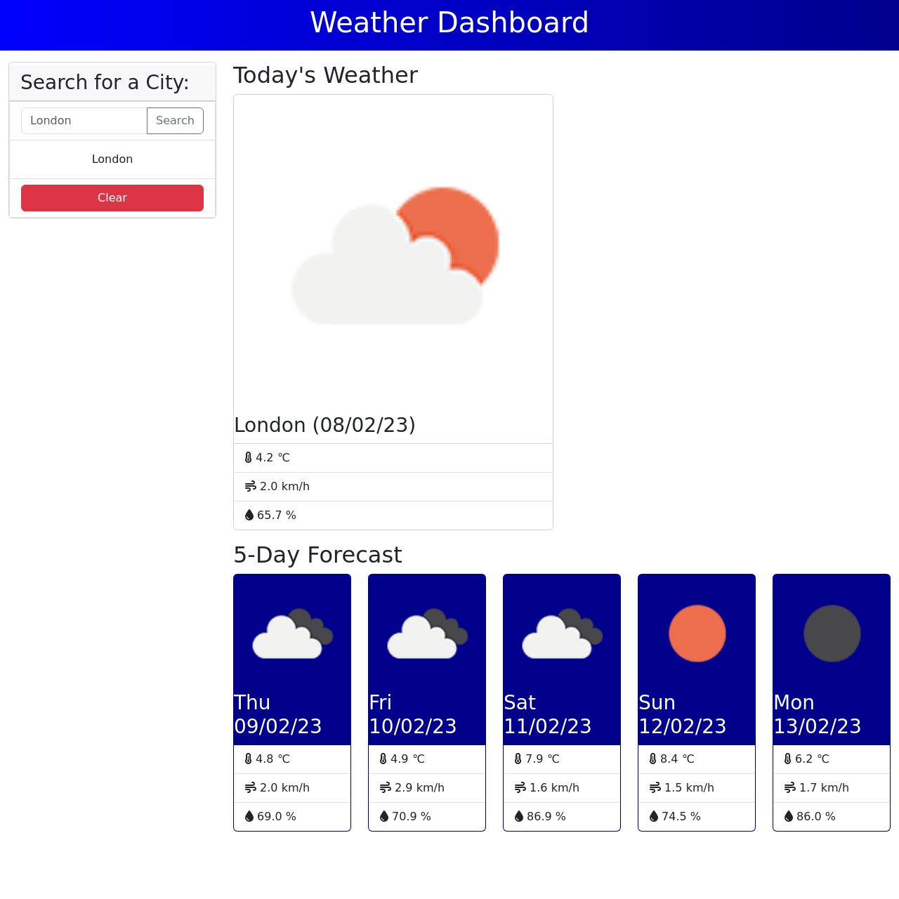

# Bootcamp Challenge 8 - Weather Dashboard

## Description 

This project was created using HTML, CSS, Bootstrap, Font Awesome, Javascript and JQuery to make a Word Guessing Game. The project had the following requirements:

* Make a page that looks like the following mock up:

* Use the [5 Day Weather Forecast](https://openweathermap.org/forecast5) to retrieve weather data for cities.
* The base URL for your API calls should look like the following: `https://api.openweathermap.org/data/2.5/forecast?lat={lat}&lon={lon}&appid={API key}`.
* The app must take a city from an input field completed by a user and convert it to a latitude and longitude.
* When a user searches for a city they are presented with current and future conditions for that city and that city is added to the search history
  * When a user views the current weather conditions for that city they are presented with:
    * The city name
    * The date
    * An icon representation of weather conditions
    * The temperature
    * The humidity
    * The wind speed
  * When a user view future weather conditions for that city they are presented with a 5-day forecast that displays:
    * The date
    * An icon representation of weather conditions
    * The temperature
    * The humidity
  * When a user click on a city in the search history they are again presented with current and future conditions for that city.
* Uses `localStorage` to store persistent data.

The page in this repo is the result.

## Installation

The site does not require installation steps.

## Usage 

The website can be viewed at [https://bowseruk.github.io/weather-dashboard/](https://bowseruk.github.io/weather-dashboard/) with Google Chrome. The source can be viewed in Chrome by right clicking and selecting inspect.

## Credits

* This site was based on a project by edX Boot Camps LLC.

* [W3School](https://www.w3schools.com/) was used as a reference for elements to use and good practice.

* The changes were checked with [W3C Validator](https://validator.w3.org/).

* [Stack Overflow](https://stackoverflow.com/) always seems to have the answer to a problem that occurs.

* [MDN](https://developer.mozilla.org/en-US/) is a very comprehensive and useful resource.

* [Font Awesome]() was used and the documentation referenced.

* [JQuery](https://api.jquery.com/) documentation was referred to throughout the project.

* [Day.js](https://day.js.org/en/) was used, and the documentation was referred to throughout the project.

* [5 Day Weather Forecast](https://openweathermap.org/forecast5) API was used for the project.

## License

This project uses the licence in the LICENCE file of the repo.